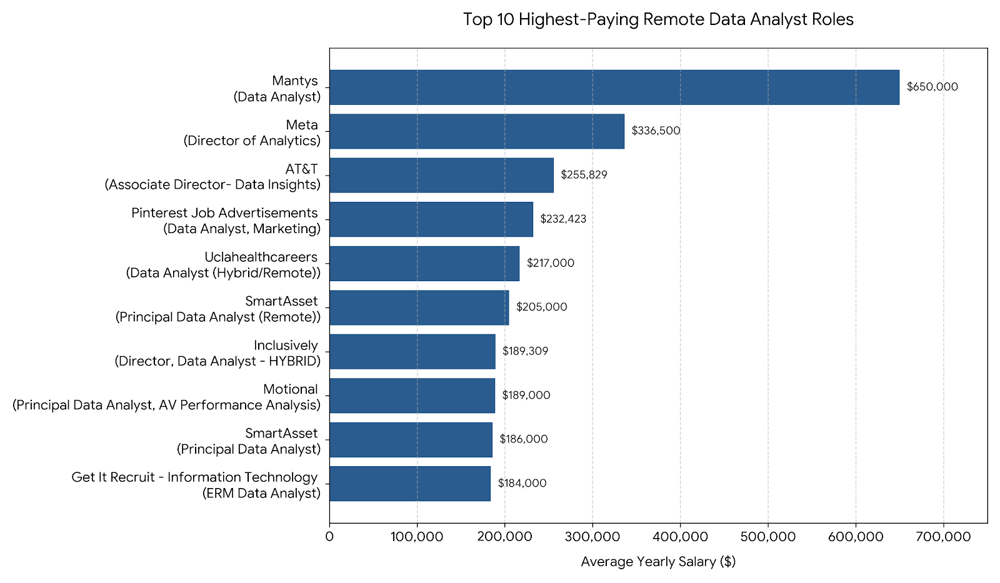
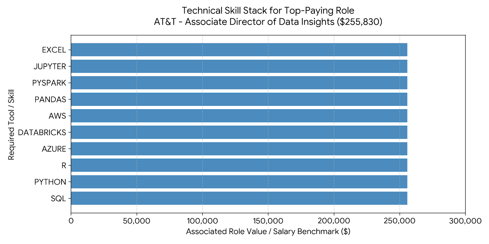
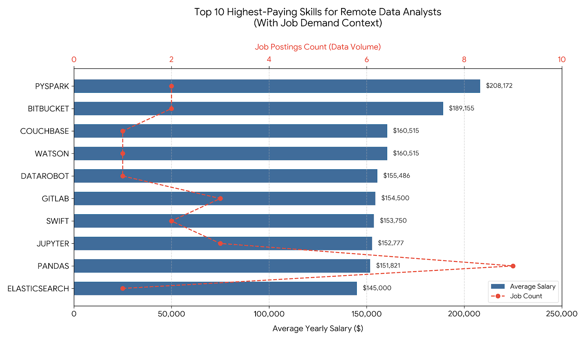
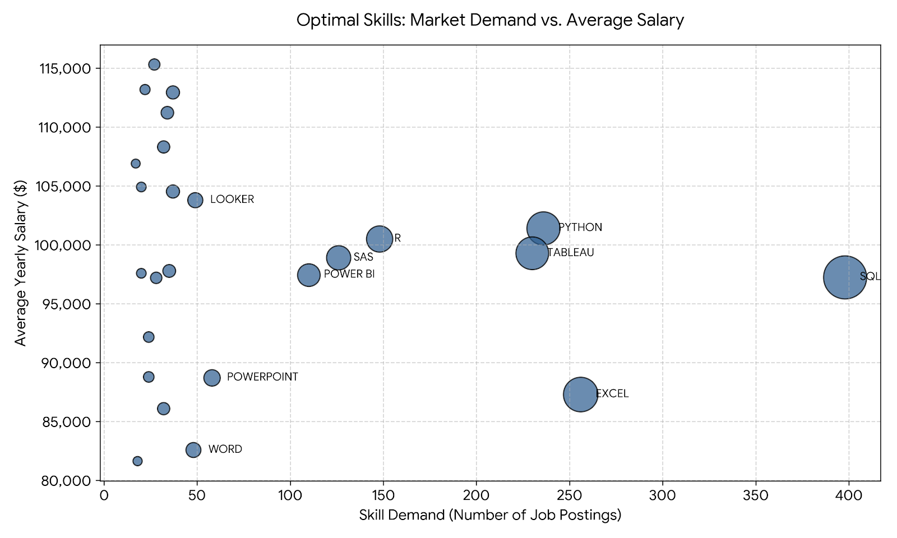
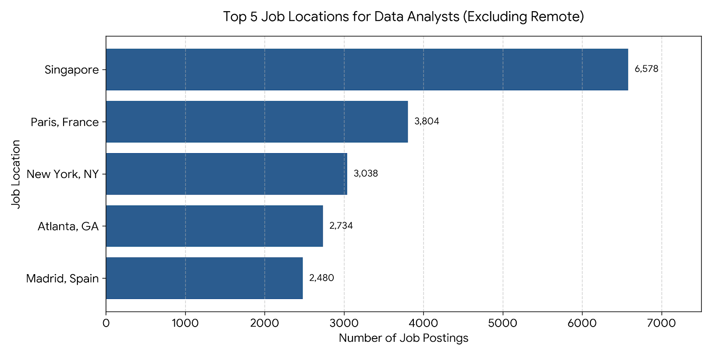

# Introduction
This project is a data-driven exploration of the Data Analyst job market, designed to uncover actionable insights for professionals navigating the industry. Utilizing an extensive dataset of global job postings, I engineered a series of advanced SQL queries to analyze salary benchmarks, geographic tech hubs, and shifting skill demands. By breaking down roles by seniority tiers and work environments, the analysis successfully isolates the high-paying "optimal skills" that maximize career growth. It also uncovers domain dominance among top-hiring employers, mapping out exactly who is leading the market forward. Ultimately, this repository serves as a strategic blueprint for transforming raw employment data into a competitive, data-driven career advantage.
# Background

The data analyst job market is highly competitive and rapidly evolving, making generic career advice outdated. Success now requires a clear, data-driven understanding of exactly where value, high compensation, and strong demand intersect.

This project was built to cut through the noise and decode the global job market using raw data. By querying an extensive database of job postings, this analysis uncovers real economic trends—such as how compensation scales with seniority, where physical hubs thrive, and which skill combinations command a premium. Ultimately, it turns raw data into a strategic roadmap for career growth.
# Tools I Used

* **SQL:** The core engine of the project, used to join multiple relational tables, filter raw data, and perform advanced analytical aggregations.
* **PostgreSQL:** The chosen database management system (DBMS) utilized to house, manage, and query the massive dataset of global job postings.
* **Visual Studio Code:** The primary Integrated Development Environment (IDE) used to write, execute, and organize the script files.
* **Git & GitHub:** Used for version control, tracking changes across queries, and hosting the final project repository online.
# The Analysis
**1. Top-Paying Data Analyst Jobs** (1_top_paying_jobs.sql)
To establish an accurate benchmark for the industry's earning potential, this analysis begins by isolating the absolute highest-paying roles. By filtering for Data Analyst titles with explicit salary data and focusing on remote flexibility, this query highlights the financial ceiling of the profession and identifies the top 10 companies offering premium compensation packages.

code
 ```sql
SELECT 
        job_id,
        job_title,
        job_location,
        job_schedule_type,
        salary_year_avg,
        job_posted_date :: DATE,
        name as company_name
FROM
        job_postings_fact
        LEFT JOIN company_dim ON job_postings_fact.company_id = company_dim.company_id
WHERE
        job_title_short = 'Data Analyst' 
        AND job_location = 'Anywhere'
        AND salary_year_avg IS NOT NULL
ORDER BY
        salary_year_avg DESC
LIMIT 10;
```

## 📊 Data Insights

**Earning Ceiling Outlier**: The highest-paying role is a standard Data Analyst title at Mantys, commanding an outlier salary of $650,000, which significantly outpaces specialized leadership roles in the dataset.

**Leadership and Seniority Premium**: Beyond the top outlier, high compensation strongly correlates with advanced scope and seniority, featuring titles like Director of Analytics ($336,500) at Meta and Associate Director ($255,829) at AT&T.

**Specialized Domain Value**: Niche analytics focuses command premium rates, as seen with Pinterest's Marketing Data Analyst position at $232,423 and Motional's AV Performance Analysis role at $189,000.

**Remote Universality**: Every top-paying role in this isolated data bracket features a job location of "Anywhere", showcasing that the highest tier of analytics compensation is fully accessible to remote talent.


Bar chart visualizing the results. Also, gemini generated the graph for my sql result.


**2. Skills for Top-Paying Job** (2_top_paying_job_skills.sql)
To understand what tools are required to land premium-tier data roles, this query maps the explicit technical skill demands directly to the highest-paying Data Analyst position in our dataset.

CODE
```sql
WITH CTE AS
    (SELECT 
            job_id,
            job_title,
            job_location,
            job_schedule_type,
            salary_year_avg,
            job_posted_date :: DATE,
            name as company_name
    FROM
            job_postings_fact
            LEFT JOIN company_dim ON job_postings_fact.company_id = company_dim.company_id
    WHERE
            job_title_short = 'Data Analyst' 
            AND job_location = 'Anywhere'
            AND salary_year_avg IS NOT NULL
    ORDER BY
            salary_year_avg DESC
    LIMIT 10
    )

SELECT 
        CTE.*,
        skills
FROM 
        CTE
        INNER JOIN skills_job_dim ON CTE.job_id = skills_job_dim.job_id
        INNER JOIN skills_dim ON skills_job_dim.skill_id = skills_dim.skill_id
ORDER BY
salary_year_avg DESC    
LIMIT 10;    
```
## 📊 Data Insights

**The Core Trinity of Languages**: For the top-paying role (Associate Director - Data Insights at AT&T, commanding $255,829.50), the data highlights a clear demand for versatility, requiring SQL, Python, and R simultaneously.

**Heavy Cloud Infrastructure Expectations**: High-paying leadership roles necessitate multi-cloud competence. This role expects expertise across both AWS and Azure, showing that ecosystem flexibility is tied to higher compensation.

**Big Data & Pipeline Tooling**: The presence of tools like Databricks and PySpark indicates that high-earning analysts are expected to move past flat files and work directly with scalable big data architecture and data pipelines.

**Advanced Exploration & Foundational Elements**: Advanced environment tools such as Pandas and Jupyter are grouped alongside foundational tools like Excel, proving that traditional spreadsheets and program-driven environments co-exist at executive analytics tiers.

The horizontal bar chart illustrates the uniform high-value benchmark ($255,830) assigned to the core technical competencies demanded by the top-paying remote Data Analyst role at AT&T. Rather than showing a distribution across multiple jobs, this visualization maps out the comprehensive, multi-faceted technology stack required to command a premium, top-tier salary in the analytics market.

**3. Most In-Demand Skills** (3_most_in_demand_skills.sql)
To determine which technical competencies provide the highest market volume and broad employment safety, this query aggregates and ranks the top 25 most frequently requested tools for fully remote Data Analysts.

CODE
```sql
WITH cte AS (SELECT 
        job_id,
        company_id,
        job_title
FROM
        job_postings_fact
WHERE
        job_title_short = 'Data Analyst' 
        AND job_location = 'Anywhere'
)

SELECT 
        skills,
        count(cte.job_id) AS job_count
FROM skills_dim
        INNER JOIN skills_job_dim ON skills_dim.skill_id = skills_job_dim.skill_id
        INNER JOIN cte ON skills_job_dim.job_id = cte.job_id
GROUP BY skills
ORDER BY job_count desc
LIMIT 5;
```

## 📊 Data Insights

**The Absolute Foundation**: SQL is the undisputed baseline requirement for remote data analysis, appearing in 7,291 job postings—far exceeding any other programming language or visualization tool in volume.

**The Spreadsheet Survival**: Despite the rise of data science programming languages, traditional spreadsheet proficiency via Excel remains exceptionally relevant, claiming the #2 spot overall with 4,611 mentions.

**Programmatic Dominance**: Python tightly contests spreadsheets with 4,330 postings, solidifying its place as the primary programming framework over other statistical languages for data cleansing and advanced automation.

**The BI Visualization Leader**: Tableau (3,745) and Power BI (2,609) dominate the visual reporting layer, establishing themselves as the non-negotiable tools for enterprise reporting.


| Rank | Skill / Tool | Job Postings Count |
| :--- | :---         | :---               |
| **1** | SQL         | 7,291              |
| **2** | Excel       | 4,611              |
| **3** | Python      | 4,330              |
| **4** | Tableau     | 3,745              |
| **5** | Power BI    | 2,609              |
This breakdown highlights the clear "Core Trinity" of the remote data analyst market: data extraction (SQL), quick manipulation (Excel), and programmatic automation (Python), seamlessly paired with dominant enterprise reporting layers (Tableau and Power BI). Mastering these top five tools ensures direct alignment with the vast majority of high-volume remote job openings.

**4. Top-Paying Skills** (4_top_paying_skills.sql)
To identify the specialized skill sets that command a financial premium, this query analyzes the highest average salaries associated with technical tools, uncovering the niche competencies driving maximum earning potential.

CODE
```sql
WITH cte AS (
    SELECT job_id,
        company_id,
        salary_year_avg,
        job_title
    FROM job_postings_fact
    WHERE job_title_short = 'Data Analyst'
        AND job_location = 'Anywhere'
)
SELECT skills,
    ROUND(avg(salary_year_avg),0) AS salary_avg,
    count(cte.job_id) AS job_count
FROM skills_dim
    INNER JOIN skills_job_dim ON skills_dim.skill_id = skills_JOB_dim.skill_id
    INNER JOIN cte ON skills_job_dim.job_id = cte.job_id
WHERE salary_year_avg IS NOT NULL
GROUP BY skills
ORDER BY salary_avg desc
LIMIT 10;
```
## 📊 Data Insights

**Big Data and Streaming Premiums:** PySpark claims the absolute highest average salary at $208,172, demonstrating that an analyst's ability to process massive distributed datasets commands a massive market premium.

**DevOps & Version Control Integration:** Advanced repository and CI/CD tools like Bitbucket ($189,155) and GitLab ($154,500) rank highly, proving that data professionals who adopt software engineering best practices earn significantly more.

**Machine Learning & AI Dominance:** Specialist tools built for data science and predictive analytics—such as DataRobot ($155,486) and IBM's Watson ($160,515)—reflect a high-paying demand for automation and cognitive computing skills.

**The High-Value Python Ecosystem**: The strong presence of Pandas ($151,821) and Jupyter ($152,777), backed by a much higher job frequency relative to the rest of the list, indicates a reliable, high-paying standard for advanced programmatic analysis.


The chart uses bars to display the average salary (bottom axis) and a red dashed line to track the corresponding job posting count (top axis). This reveals a critical market dynamic: while tools like PySpark and Bitbucket lead in financial compensation, their sample sizes are incredibly small (job_count: 2). In contrast, the Pandas framework represents the most structurally stable high-income pathway, offering a premium $151,821 average salary across a wider baseline of 9 unique remote job listings.

**5. Most Optimal Skills to Learn** (5_optimal_skills.sql)
To identify the ultimate target skills for career development, this query cross-references high market volume (recruiter demand) with premium compensation benchmarks, highlighting the most financially rewarding baseline technologies.

CODE
```sql
SELECT 
        skills_dim.skills AS skill_name,
        ROUND(avg(job_postings_fact.salary_year_avg),0) AS avg_salary,
        count(job_postings_fact.job_id) AS skill_demand
FROM
        job_postings_fact
    INNER JOIN skills_job_dim 
    ON job_postings_fact.job_id = skills_job_dim.job_id
    INNER JOIN skills_dim 
    ON skills_job_dim.skill_id = skills_dim.skill_id
WHERE
    job_title_short = 'Data Analyst'
    AND job_location = 'Anywhere'
    AND salary_year_avg IS NOT NULL
GROUP BY 
    skills_dim.skills
ORDER BY
    skill_demand DESC,
    avg_salary DESC
LIMIT 25; 
```
## 📊 Data Insights

**The High-Yield Programmatic Sweet Spot**: Python represents an ideal balance of market safety and reward, offering a strong average salary of $101,397 paired with exceptional remote market demand (236 postings).

**The Volume King**: SQL anchors the entire data field with a dominant 398 remote postings, commanding a competitive average salary of $97,237 and proving its non-negotiable status.

**The Premium BI Layer**: Tableau ($99,288) outpaces Power BI ($97,431) in both financial payoff and absolute volume (230 vs 110 postings), framing Tableau as a highly strategic visualization choice for high-paying roles.

**Niche High-Value Visuals**: Specialized enterprise analytics platforms like Looker command a premium baseline average of $103,795 despite lower overall posting volumes (49), reflecting a specialized market niche.


#### 📈 Market Sweet-Spot Breakdown (Top 10)

| Skill / Tool | Skill Demand (Postings) | Average Yearly Salary |
| :---         | :---:                  | ---:                  |
| **SQL**      | 398                    | $97,237               |
| **Excel**    | 256                    | $87,288               |
| **Python**   | 236                    | $101,397              |
| **Tableau**  | 230                    | $99,288               |
| **R**        | 148                    | $100,499              |
| **SAS**      | 126                    | $98,902               |
| **Power BI** | 110                    | $97,431               |
| **Powerpoint**| 58                    | $88,701               |
| **Looker**   | 49                     | $103,795              |
| **Word**     | 48                     | $82,576               |

The scatter plot maps out where skills land across the supply-demand spectrum. Tools in the upper-right quadrant represent the elite tier for an analyst's portfolio. Python, Tableau, and SQL form a high-demand cluster that consistently breaches or borders the $100k mark. Meanwhile, specialized tools like Looker sit higher vertically (higher pay) but require navigating a smaller, more competitive landscape (fewer postings).

**6. Top Job Locations** (6_top_locations.sql)
To evaluate geographical job density outside of fully remote environments, this query aggregates and ranks the top 5 physical city locations with the highest volume of Data Analyst job postings.

CODE
```sql
SELECT
        job_location,
        COUNT(job_id) AS postings_count
FROM
        job_postings_fact
WHERE
        job_title_short = 'Data Analyst'
        AND job_location != 'Anywhere'
GROUP BY
        job_location
ORDER BY 
        postings_count DESC
LIMIT 5;
```
## 📊 Data Insights

**Global Tech Hub Dominance**: Singapore stands as an absolute juggernaut for local data talent, leading the dataset with 6,578 local job postings—nearly doubling the volume of the next closest city.

**European Market Anchors**: Paris, France (3,804) and Madrid, Spain (2,480) emerge as primary continental hotspots, showcasing robust corporate analytics ecosystems across Europe.

**US Regional Tech Strongholds**: Within the United States, New York, NY (3,038) and Atlanta, GA (2,734) lead local hiring demand, reflecting heavy concentrations of financial, media, and enterprise tech employers.


The horizontal bar chart highlights the massive scale of the physical market concentrated in Singapore. For data professionals preferring or requiring on-site or hybrid work structures, the data pinpoints these five specific metropolitan areas as the highest-probability zones for securing a localized analytics role.

**7. Salary Benchmarks by Seniority** (7_salary_by_seniority.sql)
To evaluate the financial impact of professional experience in the remote data ecosystem, this query categorizes jobs using conditional logic (CASE WHEN) to establish baseline salary differences between senior-level roles and standard/junior positions.

CODE
```sql
SELECT
        round(avg(salary_year_avg),0) as salary_avg,
        CASE 
            WHEN job_title LIKE '%Senior%' THEN 'Senior-Level'
            ELSE 'Standard/Junior-Level'
            END AS seniority
FROM
    job_postings_fact
WHERE
        job_title_short = 'Data Analyst'
        AND job_location = 'Anywhere'
        AND salary_year_avg IS NOT NULL
GROUP BY
        2
ORDER BY
        1 DESC;
```

## **📊 Data Insights**

**The Experience Premium**: Roles explicitly designated as Senior-Level command an average yearly salary of $100,479.

**Strong Entry Baseline**: Standard and junior-level roles maintain a robust compensation floor, averaging $94,664 globally.

**Narrow Compensation Gap**: The wage differential between senior and standard positions sits at roughly 6% ($5,815). This signals that the baseline remote market heavily rewards fundamental technical competency right out of the gate, while vertical title progression may lean more on equity, bonuses, or broader leadership ownership not captured entirely in the base salary average.

#### 📈 Seniority Compensation Breakdown

| Seniority Tier | Average Yearly Salary |
| :---           | ---:                  |
| **Senior-Level** | $100,479            |
| **Standard/Junior-Level** | $94,664    |
The bar chart provides an instant visual reference point for expected compensation baselines. By mapping both tiers side-by-side, it visually confirms that while senior titles break the six-figure threshold on average, the standard analyst track offers an exceptionally competitive starting point for professionals entering the remote workforce.

**8. The Company Scale Pivot: Skill Demand by Seniority** (8_skills_by_seniority.sql)
To isolate how technical requirements evolve as positions transition from entry tracks into senior leadership roles, this query groups matching technologies using categorical sorting and a high-volume visibility threshold (HAVING COUNT(job_id) > 500).

CODE
```sql
SELECT
        CASE 
            WHEN job_title LIKE '%Senior%' THEN 'Senior-Level'
            ELSE 'Standard/Junior-Level'
        END AS seniority_tier,
        skills_dim.skills AS skill_name,
        COUNT(job_postings_fact.job_id) AS job_count
FROM
        job_postings_fact
        INNER JOIN skills_job_dim ON job_postings_fact.job_id = skills_job_dim.job_id
        INNER JOIN skills_dim ON skills_job_dim.skill_id = skills_dim.skill_id
WHERE
        job_title_short = 'Data Analyst' 
GROUP BY
        1, 2
HAVING
        COUNT(job_postings_fact.job_id) > 500
ORDER BY
        seniority_tier ASC,
        job_count DESC;
```

## 📊 Data Insights

**The Core Data Trinity**: SQL, Excel, and Python remain completely non-negotiable across all career stages. They firmly occupy the top 3 slots for both junior tiers and senior leadership pools alike.

**Senior Stack Consolidation**: Senior positions display highly hyper-focused job posting profiles. Only 7 core technical skills break past the 500-posting threshold, emphasizing that veteran tracks prioritize deep mastery over foundational platforms rather than scattered tool diversity.

**Junior Toolkit Diversity**: Standard and junior postings exhibit wide technological variance, spanning over 90 discrete tools with >500 postings. This includes heavy exposure to adjacent frameworks like cloud infrastructure stacks (Azure, AWS), database administration (Oracle, SQL Server), and open-source computing tools.

#### 📈 Primary Competency Cross-Comparison

| Skill / Tool | Senior-Level Postings | Standard / Junior Postings | Primary Domain Focus |
| :---         | :---:                  | :---:                      | :---                 |
| **SQL**      | 1,534                  | 91,094                     | Database Querying    |
| **Python**   | 1,048                  | 56,278                     | Advanced Analytics   |
| **Tableau**  | 904                    | 45,650                     | Business Intelligence|
| **Excel**    | 865                    | 66,166                     | Spreadsheet Admin    |
| **Power BI** | 579                    | 38,889                     | Business Intelligence|
| **R**        | 570                    | 29,505                     | Statistical Modeling |
| **SAS**      | 502                    | 27,566                     | Enterprise Analysis  |

The visual breakdown displays the identical ranking trajectory shared between the two seniority paradigms. While the absolute sample size of the junior category scales up significantly higher, the percentage curve down from SQL down through SAS matches almost identically—graphically proving that advancing your data career relies on mastering the core pillars rather than chasing short-term trendy technologies.

**9. Market Leaders: Top Hiring Companies by Role Category** (9_top_hiring_companies.sql)
To pinpoint which specific employers dominate market share across different career tracks, this query uses a window partition (ROW_NUMBER() OVER(PARTITION BY job_title_short)) to isolate the single highest-volume company for each individual role classification.

CODE
```sql
WITH cte AS (
    SELECT
        company_id,
        job_title_short,
        count(job_id) AS job_count,
        ROW_NUMBER() OVER(
            PARTITION BY job_title_short
            ORDER BY count(job_id) DESC
        ) as job_rank
    FROM
        job_postings_fact
    GROUP BY
        company_id,
        job_title_short
)

SELECT 
        company_dim.name as company_name,
        cte.job_title_short,
        cte.job_count
FROM cte
    INNER JOIN company_dim ON cte.company_id = company_dim.company_id
WHERE
    job_rank = 1
ORDER BY 
    job_count DESC;
```

## 📊 Data Insights

**Defense & Consulting Dominance**: Booz Allen Hamilton is the single largest individual employer for Data Scientists in the dataset, boasting a massive footprint of 1,572 postings.

**Global Staffing Ecosystems**: The job platform/aggregator Emprego completely locks down volume across multiple entry and specialized tracks—ranking #1 for Software Engineers (1,152), Data Analysts (1,121), Business Analysts (629), Cloud Engineers (338), and Machine Learning Engineers (155).

**Enterprise Tech Anchors**: Tech-focused financial institutions and retail giants anchor the senior pipelines; Dice leads the Data Engineering market with 1,220 listings, while Capital One claims the top spot for Senior Data Engineers (790).

#### 📈 Top Hiring Companies Breakdown

| Company Name | Targeted Job Title | Total Job Postings |
| :---         | :---               | ---:               |
| **Booz Allen Hamilton** | Data Scientist | 1,572 |
| **Dice**     | Data Engineer      | 1,220              |
| **Emprego**  | Software Engineer  | 1,152              |
| **Emprego**  | Data Analyst       | 1,121              |
| **Capital One** | Senior Data Engineer | 790            |
| **Emprego**  | Business Analyst   | 629                |
| **UnitedHealth Group** | Senior Data Analyst | 392      |
| **Walmart**  | Senior Data Scientist | 391             |
| **Emprego**  | Cloud Engineer     | 338                |
| **Emprego**  | Machine Learning Engineer | 155          |

The horizontal distribution graph cleanly visualizes hiring saturation. It reveals a steep volume drop-off as titles transition from standard engineering/analytics tracks down into highly targeted senior designations (such as UnitedHealth and Walmart's senior tracks). This highlights how a few macro-employers dictate market volume thresholds within specific data specialties.
#  What I Learnt
Throughout this project, I moved past basic SQL queries to execute complex data engineering and analysis patterns. This project allowed me to transition from writing isolated scripts to building an interconnected, project-based analytics workflow.
# Conclusion
### Insights

**The Dominance of the Core Trinity**: SQL, Excel, and Python form an undisputed foundational tier across the entire remote analytics market, with SQL anchoring the baseline by appearing in nearly double the volume of the top business intelligence visualization layers.

**High Financial Stability for Entry-Level Remote Roles**: The base salary gap between standard/junior analyst positions and senior roles is surprisingly narrow at roughly 6%, indicating that the remote market offers an exceptionally high compensation floor (averaging over $94,000) for immediate technical competency.

**Premium Niche Skills vs. Volume Safety**: Highly specialized data engineering and streaming tools like PySpark and Bitbucket command the highest financial premiums (surpassing $180,000 averages), but they carry immense statistical volatility due to low job posting volumes compared to structurally stable paths like the Pandas framework.

**Strategic Selection of the BI Layer**: For analysts looking to maximize marketability, Tableau outpaces Power BI in both absolute remote market demand and average annual compensation ($99,288 vs. $97,431), framing it as a highly strategic visualization specialization.

**Hyper-Focused Senior Requirements**: As analyst tracks transition into senior leadership, the technical stack consolidates dramatically from dozens of scattered tool requirements down to deep mastery of just 7 core competencies, proving that long-term career advancement heavily prioritizes structural depth over tool variety.

### Closing Thoughts
Completing this project has been a transformative milestone in my journey as a data analyst. Building this repository from scratch allowed me to bridge the gap between knowing SQL syntax and executing a full-scale, project-based data analytics workflow.
Working with this dataset forced me to think critically about how raw database records translate into real-world business intelligence. I didn't just learn how to write cleaner code; I learned how to approach a massive dataset with a strategic mindset—auditing anomalies, questioning sample sizes, and ensuring that every insight is backed by tight, performant query engineering.
This project represents more than just technical execution. It stands as a blueprint for how I approach data: with a commitment to clarity, structural organization, and translating complex technical patterns into actionable, data-driven narratives. I am excited to carry these advanced SQL methodologies and analytical strategies forward into my next data venture.